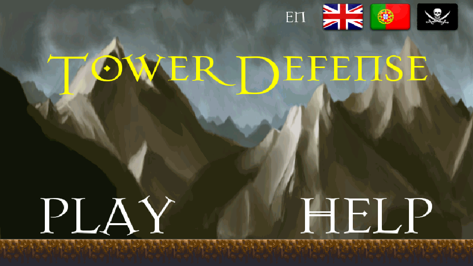
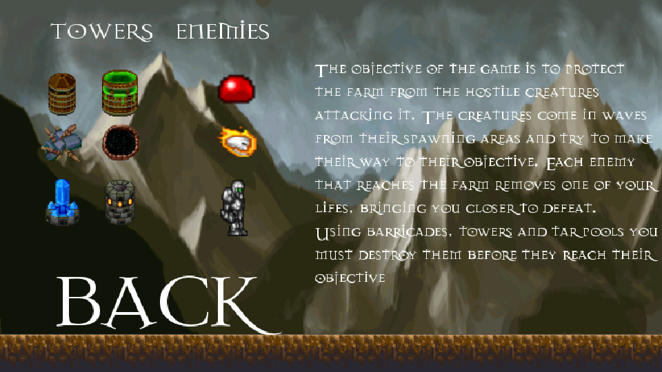
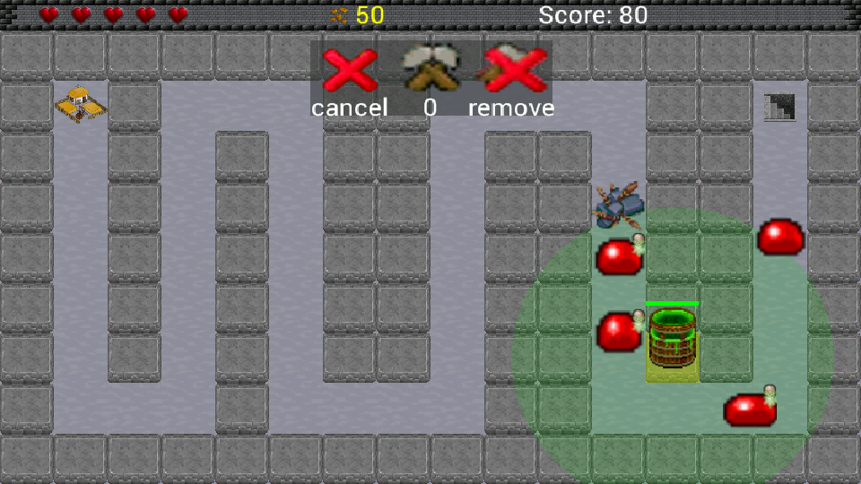
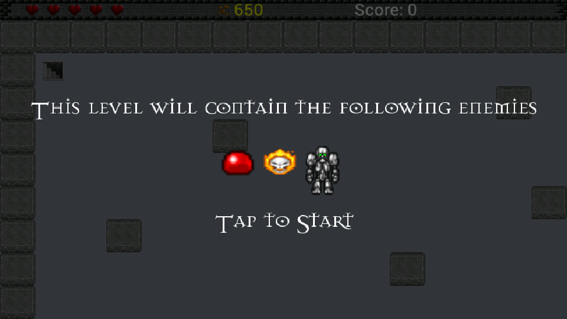
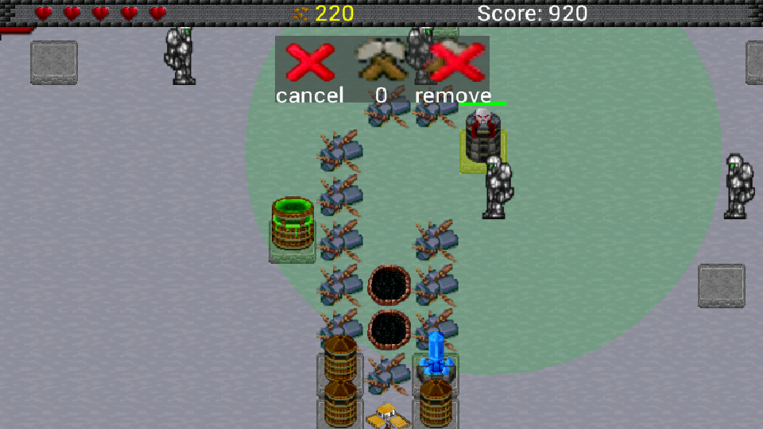
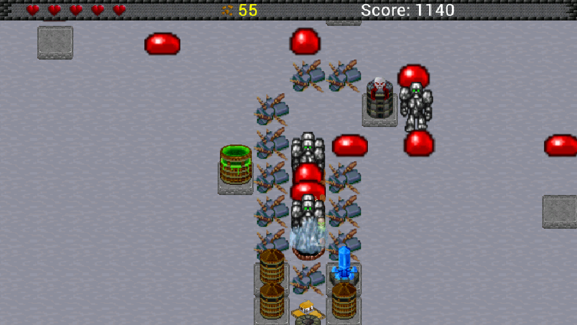

feup-lpoo-android-tower-defense
===============================

A small Tower Defense game for android, developed for the Object Oriented Programming Laboratory class of the Faculty of Engineering of the University of Porto (2012/2013), by Luís Filipe Correia Cleto and João Pedro Domingues da Rocha Marinheiro.

This project makes use of the Android Game Framework, developed by James Cho and available at http://www.kilobolt.com/game-development-tutorial.html.
Most of the graphic and music resources were obtained from http://opengameart.org/.

As this was the first android project we made (and one of the first real projects), its quality is questionable in some aspects.
Feel free to use and adapt the game but please give credit to the original authors. (See license for more details)

Screenshots
============

